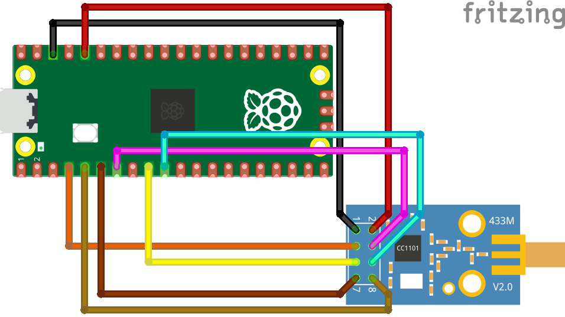
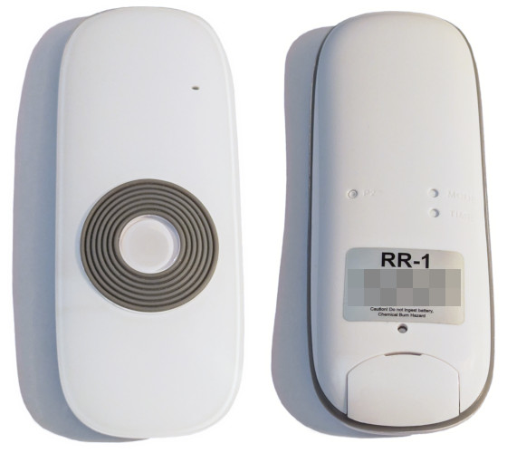

# dooya-cc1101-rf

RP2350 program to control DOOYA shutters, using a CC1101 433 MHz radio module.

# Hardware

<p align="center">

</p>

Boards:
- Raspberry Pico 2 (or 2 W)
- E07-M1101D-SMA
  ([AliExpress link](https://www.aliexpress.com/item/1005006733128122.html)), or
  equivalent CC1101-based 433 MHz radio module

Connections:
| E07-M1101D Pin | Pico Pin  | Direction          | Pin description    |
|----------------|-----------|--------------------|--------------------|
| `GND` (#1)     | Any `GND` | -                  | Ground             |
| `3V3` (#2)     | `3V3`     | -                  | Power supply       |
| `GDO0` (#3)    | `GPIO2`   | Pico &rarr; CC1101 | Modulator input    |
| `CSn` (#4)     | `GPIO5`   | Pico &rarr; CC1101 | SPI chip select    |
| `SCK` (#5)     | `GPIO6`   | Pico &rarr; CC1101 | SPI clock          |
| `MOSI/SI` (#6) | `GPIO7`   | Pico &rarr; CC1101 | SPI serial input   |
| `MISO/SO` (#7) | `GPIO4`   | CC1101 &rarr; Pico | SPI serial output  |
| `GDO2` (#8)    | `GPIO3`   | CC1101 &rarr; Pico | Demodulator output |

## Protocol and compatibility

Flipper Zero's firmware has an
[implementation](https://github.com/flipperdevices/flipperzero-firmware/blob/dev/lib/subghz/protocols/dooya.c)
of the protocol, that was used as the basis for code in this repository. The
[comment](https://github.com/flipperdevices/flipperzero-firmware/blob/c9ab2b6827fc4d646e98ad0fc15a264240b58986/lib/subghz/protocols/dooya.c#L312-L339)
in its `subghz_protocol_dooya_check_remote_controller` function provides an
explanation of the packet format.

This project has been tested against shutters whose remote control looks like
this:
<p align="center">

</p>

## Building and flashing

Download the Pico SDK (tested with version 2.1.0) and the other prerequisites:
```shell
$ sudo apt install build-essential cmake gcc-arm-none-eabi \
    libnewlib-arm-none-eabi libstdc++-arm-none-eabi-newlib

# The SDK can be downloaded into any directory. The next commands assume that
# it has been cloned into the home directory and, therefore, the resulting
# path is ~/pico-sdk.
$ git clone https://github.com/raspberrypi/pico-sdk.git --branch 2.1.0 \
    --recurse-submodules
```

Then, from this repository's root directory (note: replace `pico2` with
`pico2_w` if building for a Pico 2 W):
```shell
$ mkdir build
$ cd build
$ cmake .. -DPICO_SDK_PATH=~/pico-sdk -DPICO_BOARD=pico2
$ make
```

Lastly, connect the Pico's USB port to the computer while keeping the `BOOTSEL`
button pressed, and a new virtual disk drive will appear. Copy
`build/src/dooya-cc1101-rf.uf2` into it.

# Usage

Open a terminal over the USB serial port (e.g. with `minicom -D/dev/ttyACM0`).
Press RETURN again if you don't see the `dooya-cc1101-rf>` prompt.

List the available commands:
```
dooya-cc1101-rf> help
help                                   Show this message
sniff                                  Sniff and dump packets
set-serial <hex-value-with-6-digits>   Set the serial number to be emitted
set-channel <hex-value-with-2-digits>  Set the channel value to be emitted (default: 05)
up                                     Send the UP command
down                                   Send the DOWN command
stop                                   Send the STOP command
```

Sniff and dump packets (useful to discover the serial number of a physical
remote control):
```
dooya-cc1101-rf> sniff
Sniffer started, press RETURN to stop. Keep the remote close to the antenna!
1234560555: serial=123456 channel=05 command=stop(55) [rx timestamp=9839495 us]
1234560555: serial=123456 channel=05 command=stop(55) [rx timestamp=9896521 us]
1234560555: serial=123456 channel=05 command=stop(55) [rx timestamp=9953602 us]
```

Set the serial number to be emitted (it can safely be set to the same value as
the physical remote control - unlike other protocols, this one does not employ
rolling codes that would eventually make the original remote stop working):
```
dooya-cc1101-rf> set-serial 123456
```

Set the channel value to be emitted (again, to be set to the same value as the
physical remote control - defaults to `05` if not called):
```
dooya-cc1101-rf> set-channel 05
```

Activate the shutter by simulating button presses with the `up`, `down` and
`stop` commands:
```
dooya-cc1101-rf> up
1234560511: serial=123456 channel=05 command=up_pressed(11) [tx timestamp=18255902 us]
1234560511: serial=123456 channel=05 command=up_pressed(11) [tx timestamp=18314987 us]
1234560511: serial=123456 channel=05 command=up_pressed(11) [tx timestamp=18374063 us]
1234560511: serial=123456 channel=05 command=up_pressed(11) [tx timestamp=18433136 us]
1234560511: serial=123456 channel=05 command=up_pressed(11) [tx timestamp=18492210 us]
123456051E: serial=123456 channel=05 command=up_depressed(1E) [tx timestamp=18551290 us]
123456051E: serial=123456 channel=05 command=up_depressed(1E) [tx timestamp=18610367 us]
123456051E: serial=123456 channel=05 command=up_depressed(1E) [tx timestamp=18669443 us]
123456051E: serial=123456 channel=05 command=up_depressed(1E) [tx timestamp=18728521 us]
123456051E: serial=123456 channel=05 command=up_depressed(1E) [tx timestamp=18787596 us]
```

# License

Code in this repository follows the same license as Flipper Zero's firmware, the
[GNU General Public License, version 3](LICENSE.txt).
